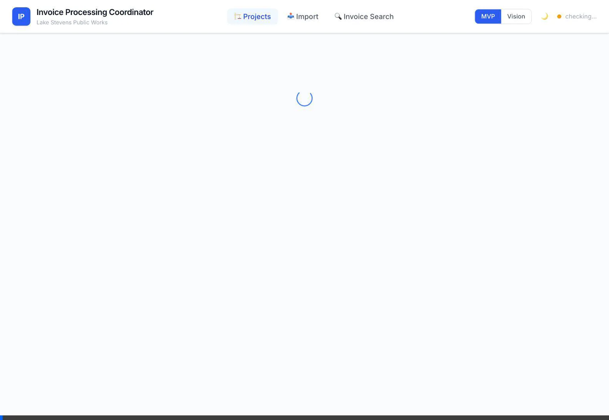
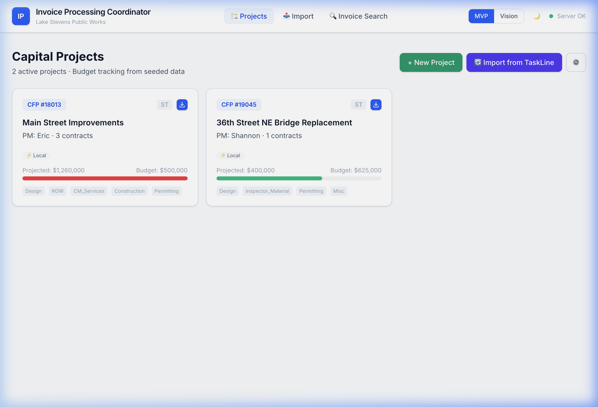
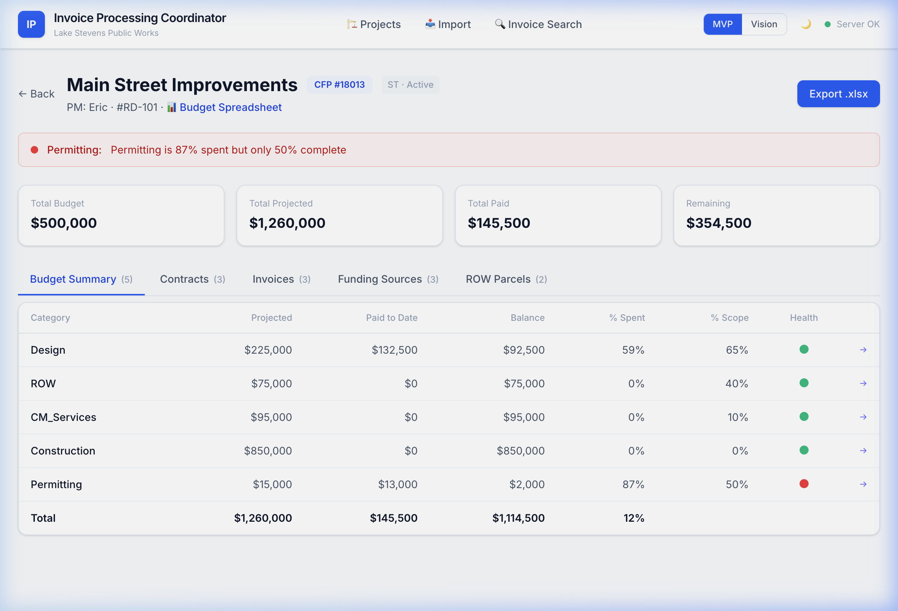
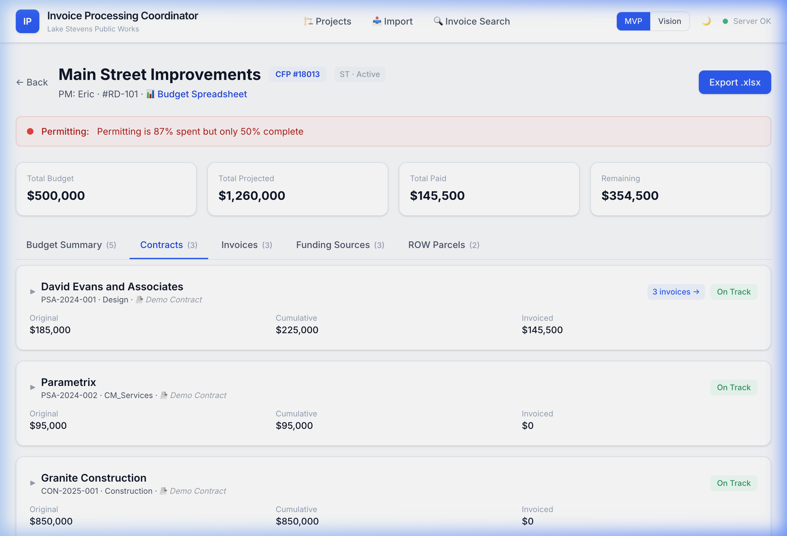
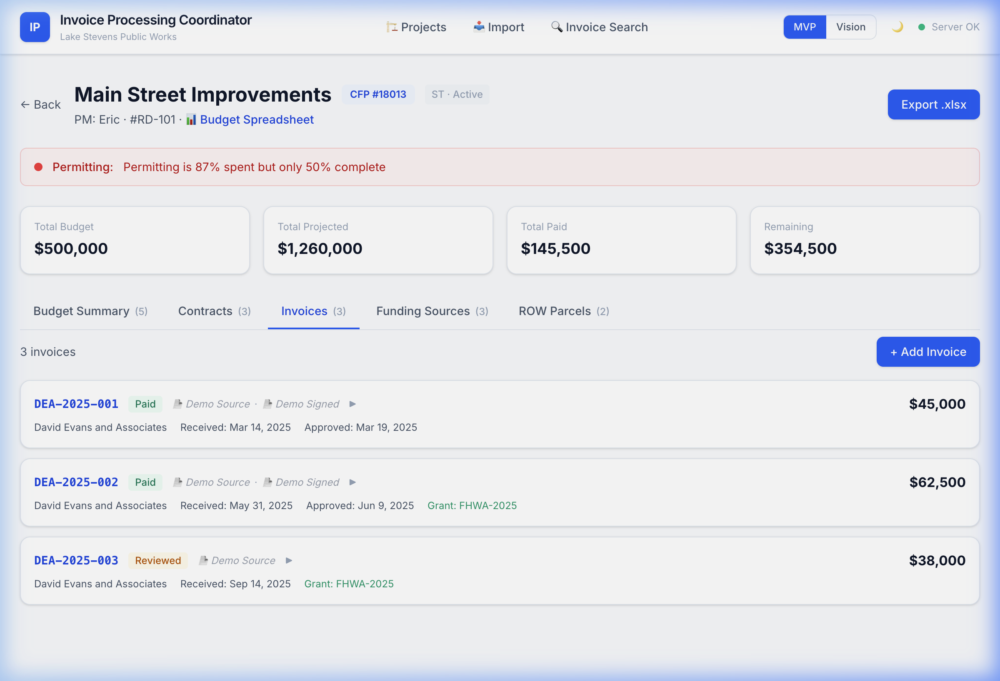
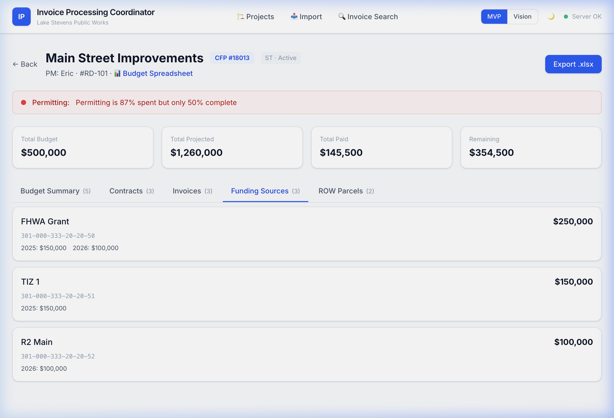
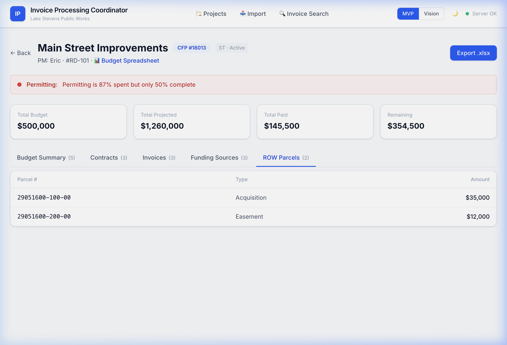
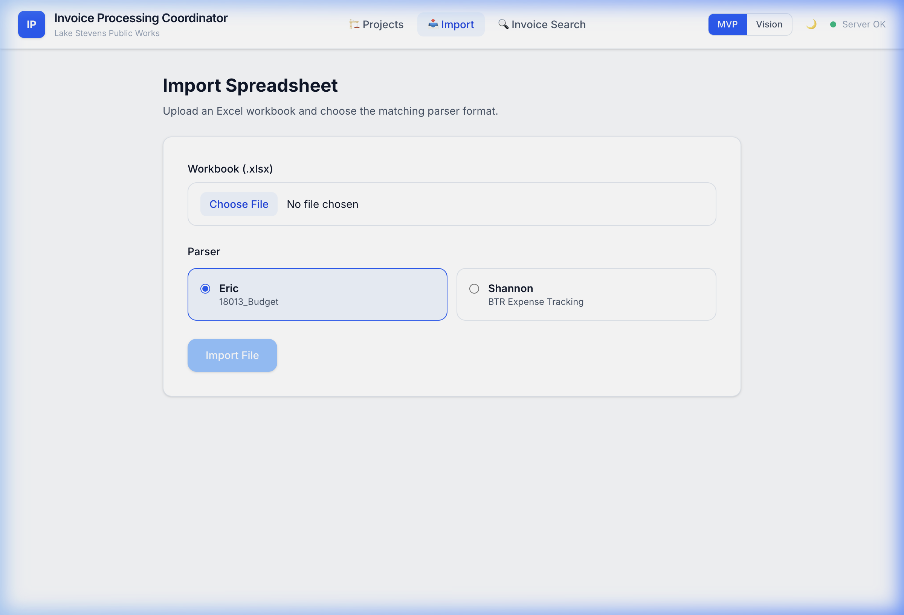
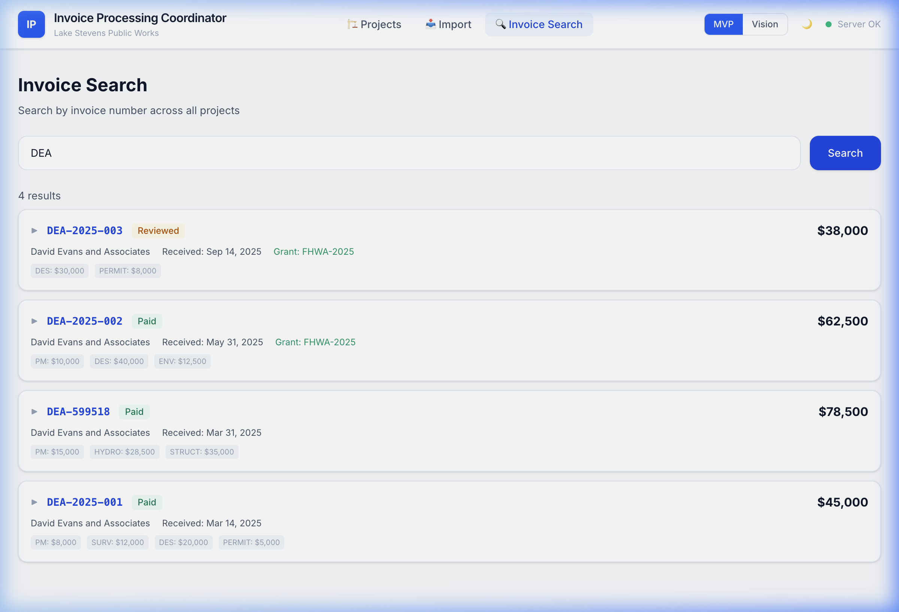

# MVP Walkthrough — What's Working Today

> This document shows what the Invoice Processing Coordinator can do **right now** in MVP mode. These are the core features that address your most critical needs from discovery.

---

## Video Walkthroughs

---

## 1. Projects List — Your Portfolio at a Glance

**What you asked for:** "We'd like to see all our projects, where we're at with our invoices."

**What you get:** Every capital project on one screen with budget health indicators (green/red), project type tags, and contract counts.

- **Main Street Improvements** — CFP #18013, Eric's project, 3 contracts
- **36th St Bridge Replacement** — CFP #19045, Shannon's project, 1 contract
- Budget health bar shows at-a-glance: green = on track, red = watch it

---

## 2. Project Detail — Everything About One Project

**What you asked for:** "One area where you can see all this information about a project... and get to all those different components from that one view."

### Budget Summary + Gut-Check Alerts

The thing Shannon does in her head — "spent almost all their budget, don't even have 30% design yet" — now happens automatically:

- **🔴 Permitting:** 87% spent but only 50% complete — automatic alert, no mental math
- Budget summary cards: Total Budget, Projected, Paid, Remaining
- Each budget category shows: Projected, Paid to Date, Balance, % Spent, % Scope, Health indicator
- **Paid to Date is computed from invoices** — not manually entered

### Contracts Tab

**What you asked for:** Links to signed contracts, supplements tracked separately.

- Three contract types: Design, CM Services, Construction
- Each contract shows: vendor, original amount, supplements (discrete records, not edits to a number)
- ✅ Exactly what Eric showed us — "original contract plus supplement 1, supplement 2, cumulative total"

### Invoices Tab

**What you asked for:** Invoice logging with task breakdown.

- Invoice number is first-class — Shannon's primary lookup key
- Status tracking: Received → Logged → Reviewed → Signed → Paid
- Grant eligibility flag + grant code per invoice
- Amounts roll up automatically into budget line items

### Funding Sources Tab

**What you asked for:** "Budget sources that we're going to pull money from."

- Source name, Springbrook budget code (display-only — never writes to Springbrook)
- Allocated amount per source
- Multiple funding sources per project (FHWA Grant, TIZ 1, R2 Main)

### ROW Parcels Tab

**What you asked for:** "Right-of-way tracking is a different animal."

- Tracked by parcel number, not by invoice
- Separate from the invoice workflow — its own tab, its own data
- Expenditure types and amounts per parcel

---

## 3. Import — Bring Your Existing Data

**What you asked for:** "We're not starting over."

- Upload your existing .xlsx — Eric's format OR Shannon's format
- The system auto-detects which format and parses accordingly
- No re-entry. Your years of spreadsheet data import directly.

✅ Eric's Main Street (18013) imports with all 3 contract types
✅ Shannon's 36th St Bridge imports from BTR worksheet

---

## 4. Invoice Search — Find Any Invoice Across All Projects

**What you asked for:** Shannon's reimbursement workflow starts with "I look for the invoice numbers."

- Search by invoice number, vendor, or partial match
- Results span ALL projects (not just one project at a time)
- Shows: project name, invoice #, vendor, amount, status, grant code

---

## 5. Export — Your Safety Net

Not screenshotted but available: any project can be exported to a standardized .xlsx and dropped back into SharePoint. **Over time, you stop exporting because the app is better. But the option is always there.**

---

## What's Left To Do in MVP

| Feature | Status | What's Missing |
|---------|--------|----------------|
| Projects List | ✅ Complete | — |
| Project Detail (all tabs) | ✅ Complete | — |
| Gut-Check Alerts | ✅ Complete | Thresholds not yet configurable |
| Import (Eric + Shannon) | ✅ Complete | Eric re-import dedup needs work |
| Export .xlsx | ✅ Complete | — |
| Invoice Search | ✅ Complete | — |
| Create New Project | ✅ Complete | Contract type auto-generation working |
| Add Invoice | ✅ UI exists | Task breakdown entry could be streamlined |
| Add Contract Supplement | ✅ Complete | — |
| **Finance Tracker Import** | ❌ Not started | Needs Finance team agreement |
| **SharePoint Auto-Sync** | ❌ Not started | Needs IT Director meeting |
| **PDF Invoice Parsing** | ❌ Not started | Would eliminate manual data entry |
| **Multi-user Auth** | ❌ Not started | Required for production |
