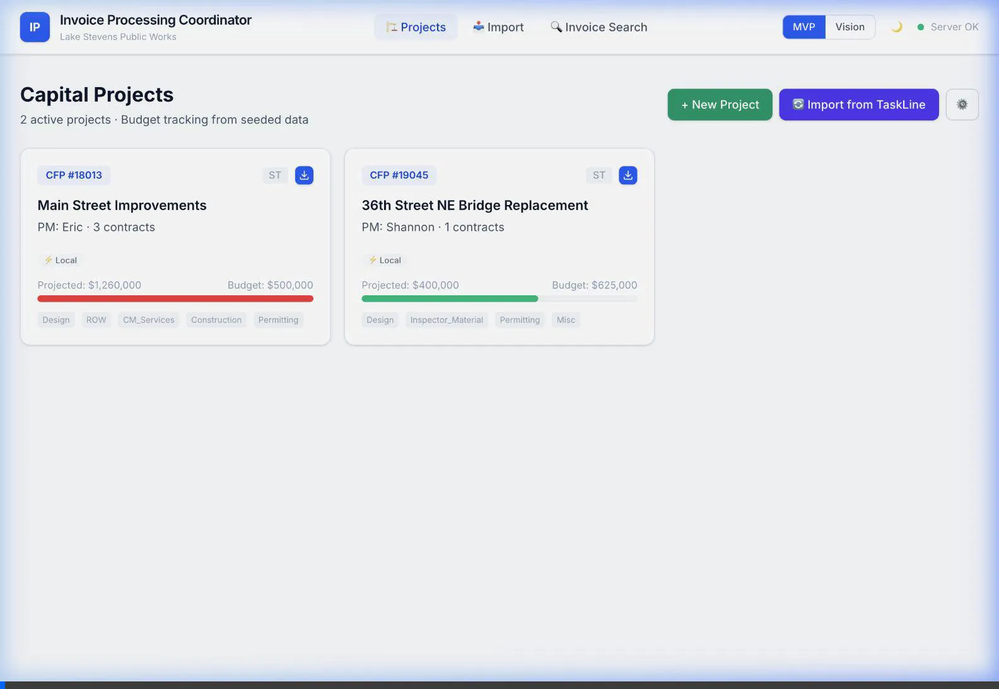
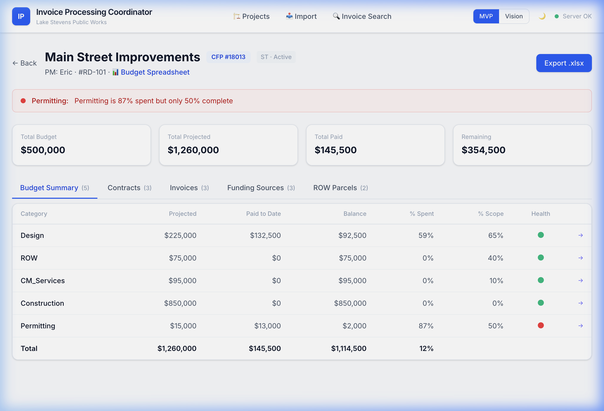
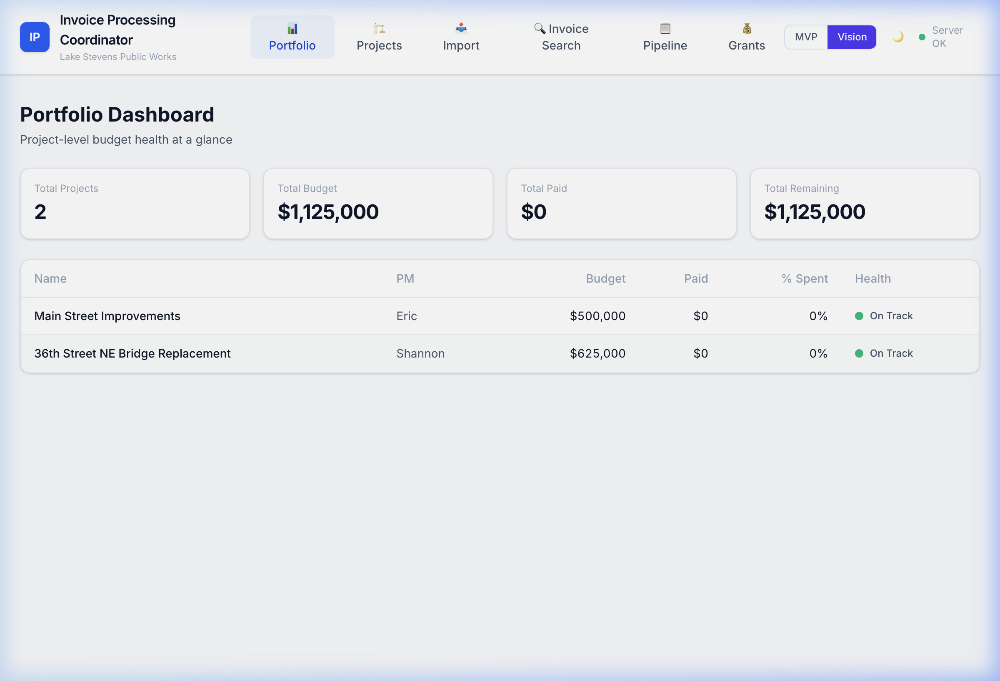
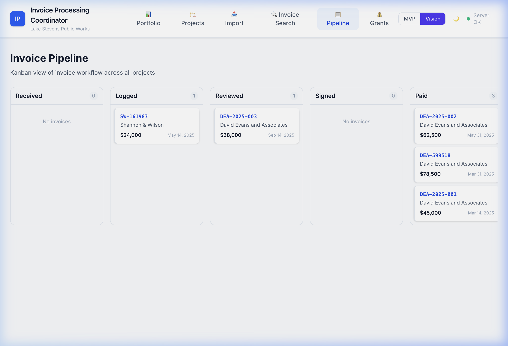
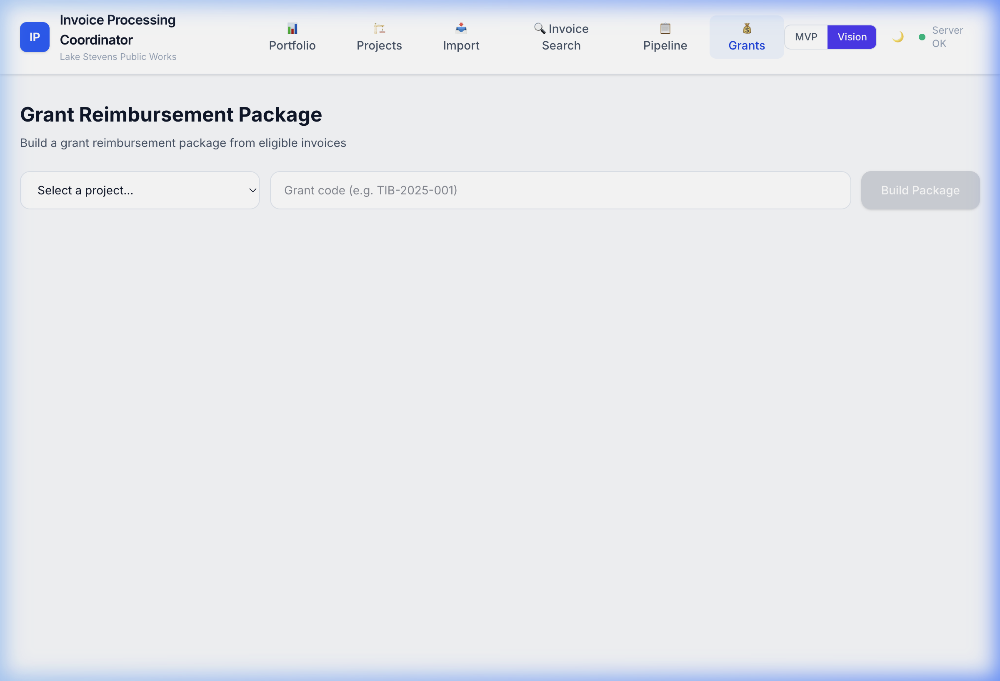
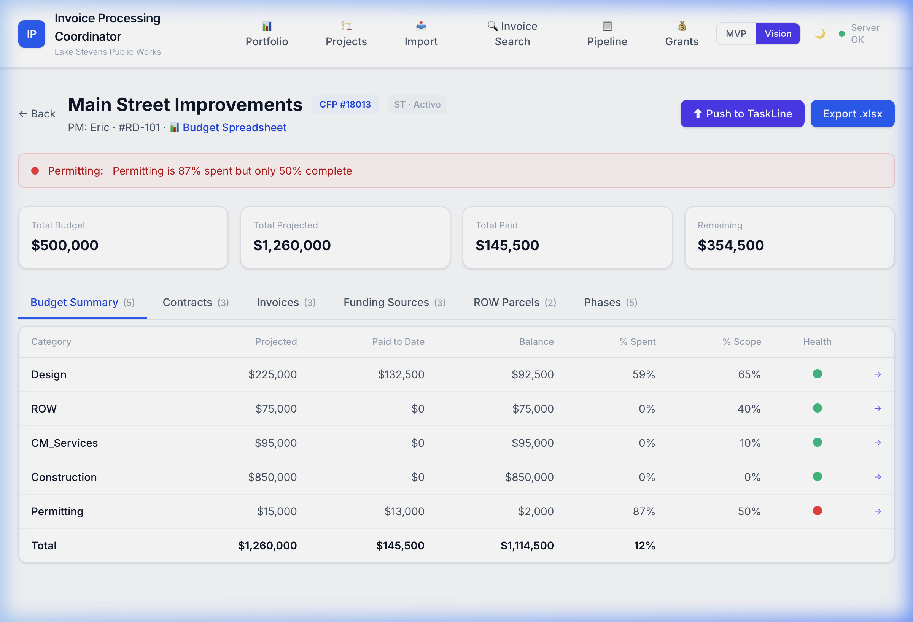

# Vision Walkthrough — Where We're Going

> These features build on the MVP foundation. They're **functional today** but classified as Priority 2/3 from discovery — the stretch goals. Toggle to "Vision" mode to access them.

---

## Video Walkthrough

---

## The MVP/Vision Toggle

The app has a built-in toggle so you can switch between MVP (core functionality) and Vision (full feature set) at any time:

- **MVP:** 3 nav items — Projects, Import, Invoice Search
- **Vision:** 6 nav items — adds Portfolio, Pipeline, Grants

---

## 1. Portfolio Dashboard — All Projects, One View

**What Eric asked for:** "One area where you can see all this information."

- Summary cards: Total Projects (2), Total Budget ($1,125,000), Total Paid, Total Remaining
- Per-project table: Name, PM, Budget, Paid, % Spent, Health indicator
- Both projects show "On Track" — green health status
- **This is the "bird's eye view" nobody had before**

---

## 2. Invoice Pipeline — The Workflow Made Visible

**What was discussed:** The approval workflow that currently happens in email/Adobe Sign, made visible.

- Five columns: Received → Logged → Reviewed → Signed → Paid
- Every invoice across all projects in one view
- Real data: DEA-2025-001 ($45,000) is Paid, DEA-2025-003 ($38,000) is in Review
- **Shannon can see at a glance: which invoices need her attention right now**

---

## 3. Grant Reimbursement Package — Shannon's Pain Point, Automated

**What Shannon described:** "I look at the invoice numbers, go to SharePoint, search for each one, cross-reference, pull them together for the reimbursement."

- Select a project, enter a grant code (e.g., TIB-2025-001)
- Click "Build Package" — system finds all eligible invoices automatically
- **No more manually searching SharePoint by invoice number**

> [!NOTE]
> The package builder filters and assembles. In a future phase, it will export the assembled package as a downloadable reimbursement submission.

---

## 4. TaskLine Integration — Budget Meets Milestones

**What was discussed:** "TaskLine shows your milestones, this shows your money."

- **Push to TaskLine** button syncs project data to TaskLine for milestone/schedule tracking
- **Budget Spreadsheet** link connects to the source SharePoint file
- **Phases tab** (visible in Vision, hidden in MVP) shows project lifecycle phases
- Budget actuals from IPC flow into TaskLine; milestone progress from TaskLine flows back

---

## Vision Feature Summary

| Feature | Status | Discovery Reference |
|---------|--------|-------------------|
| Portfolio Dashboard | ✅ Functional | Eric: "one area to see all projects" |
| Invoice Pipeline (Kanban) | ✅ Functional | Priority 2: workflow visibility |
| Grant Reimbursement Builder | ✅ UI, partial logic | Shannon's manual reimbursement process |
| TaskLine Push/Pull | ✅ Functional | "TaskLine shows milestones, IPC shows money" |
| Phases Tab | ✅ Functional | Eric's Planner milestone concept |
| **Finance Delta View** | ❌ Placeholder only | Eric: "our version vs their version" |
| **SharePoint Auto-Metadata** | ❌ Not started | Eric's #1 pain point |
| **PDF Invoice Auto-Parse** | ❌ Not started | Eliminate manual data entry |
| **Agent Email Prompts** | ❌ Not started | "hey, you said this was done by X, is it?" |
| **Adobe Sign Auto-Detect** | ❌ Not started | Eric's preferred approach |
| **Council Packet Parsing** | ❌ Not started | ~1 year maturity goal |

---

## How The Two Modes Work Together

The toggle isn't just for demo — it's the rollout strategy:

1. **Start in MVP mode** — PMs import their spreadsheets, get the gut-check alerts, use the standardized view
2. **Finance engagement** — bring Finance team to the table, unlock delta reporting
3. **Flip to Vision** — Portfolio dashboard, pipeline, grant builder, TaskLine sync
4. **SharePoint integration** — the final stretch, requires IT Director coordination

Each phase builds confidence. Nobody has to adopt everything at once.
