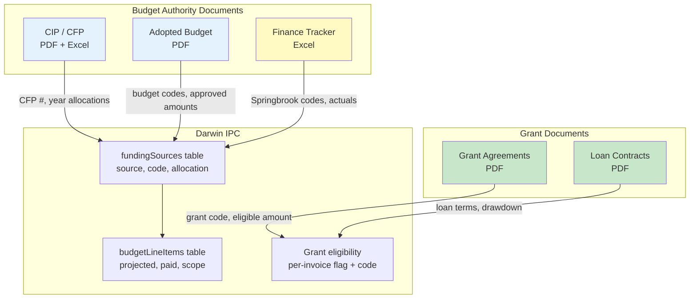

# Grant & Budget Document Ingestion — PRD

> [!NOTE]
> This covers how the city's **budget authority documents** and **grant agreements** feed into Darwin IPC. These documents establish the "allowed" budget — the ceiling against which invoices are tracked.

---

## Problem Statement

Today, budget allocations and grant funding exist in **at least 5 separate document types** across SharePoint and physical/PDF formats. PMs manually cross-reference these when setting up project trackers. No automated path from "budget approved" to "tracker ready."

> **Eric:** "Each capital project has a list of budget sources that we're going to pull money from... The budget code, how much is allocated, how much spent — where is that source document? It's in another Excel sheet."
>
> **Eric:** "These budget codes all exist in our adopted budget every year."

---

## Document Universe

### 1. Adopted Annual Budget (CIP Section)

| Attribute | Detail |
|-----------|--------|
| **What** | Council-adopted Capital Improvement Plan budget, approved annually |
| **Format** | PDF (published by Finance), Excel backup on SharePoint |
| **Contains** | Project names, CFP numbers, budget codes, approved allocations by year, fund sources |
| **Who Produces** | Finance Department, adopted by City Council |
| **Frequency** | Annually (January adoption cycle) |
| **Data Extracted** | Project → approved budget amount per year, budget codes, fund allocations |

> **Eric:** "Once we adopted budget every year, every capital project basically has a list of budget sources... with a specific amount of money."

### 2. Capital Facilities Plan (CFP 2026-2046)

| Attribute | Detail |
|-----------|--------|
| **What** | 20-year planning horizon for infrastructure |
| **Format** | PDF (published), Excel on SharePoint |
| **Contains** | CFP numbers (the primary identifier), project descriptions, 20-year cost estimates, infrastructure type classification, grant funding tracking, project locations |
| **Who Produces** | Public Works / Planning, updated annually |
| **Frequency** | Annually |
| **Data Extracted** | CFP # → project description, total estimated cost, infrastructure type, grant eligibility |

### 3. Capital Improvement Plan (CIP 2026-2031)

| Attribute | Detail |
|-----------|--------|
| **What** | 6-year project budget with year-by-year allocations |
| **Format** | PDF + Excel |
| **Contains** | CFP #, project costs by year, health metrics, unfunded projects list |
| **Who Produces** | Public Works |
| **Frequency** | Annually |
| **Data Extracted** | Year-by-year budget allocations, project health indicators |

### 4. Finance Capital Project Tracker

| Attribute | Detail |
|-----------|--------|
| **What** | Master list of every budgeted capital project with Springbrook codes |
| **Format** | Excel (.xlsx) on SharePoint |
| **Contains** | Budget codes, Springbrook account numbers, fund descriptions, contract names, budgeted vs spent, amounts remaining |
| **Who Produces** | Finance team (Anna) |
| **Frequency** | Continuously updated |
| **Data Extracted** | Budget codes, approved amounts, actual expenditures (Springbrook), contractor payment status |

> **Daniel:** "I would only want read access to this because we should not be updating finance."

### 5. Grant / Loan Agreements

| Attribute | Detail |
|-----------|--------|
| **What** | Signed grant/loan contracts (e.g., FHWA Grant, PWTF Loan, TIB Grant) |
| **Format** | PDF (signed agreements), some in SharePoint |
| **Contains** | Grant amount, eligible expenses, reimbursement terms, match requirements, drawdown schedules, reporting deadlines |
| **Who Produces** | Granting agencies (federal/state/local), signed by city |
| **Frequency** | Per-project (tied to project lifecycle) |
| **Data Extracted** | Grant code, max reimbursable amount, eligible invoice categories, reporting deadlines |

---

## How These Feed Into IPC

### Data Flow: Budget → Funding Sources → Budget Line Items

| IPC Field | Source Document | Ingestion Method |
|-----------|----------------|-----------------|
| `fundingSources.sourceName` | CIP/CFP | Manual → future: PDF parse |
| `fundingSources.springbrookBudgetCode` | Finance Tracker | Manual → future: Excel import |
| `fundingSources.allocatedAmount` | Adopted Budget | Manual → future: PDF/Excel parse |
| `fundingSources.yearAllocations` | CIP (6-year schedule) | Manual → future: Excel import |
| `invoices.grantCode` | Grant Agreement | Manual tag per invoice |
| `invoices.grantEligible` | Grant Agreement terms | Manual flag per invoice |

---

## Phased Ingestion Strategy

### Phase 1: Manual Entry (Current MVP)

PMs enter funding sources manually when creating a project:
- Source name, budget code, allocated amount, year breakdown
- Grant eligibility is a checkbox + code field per invoice

**This works today.** The standardized .xlsx import also brings in funding sources from Eric's Overview tab.

### Phase 2: Finance Tracker Excel Import (Near-term)

Import the Finance team's capital project tracker .xlsx to auto-populate:
- Budget codes and Springbrook account numbers
- Approved budget amounts per project
- Post-payment actuals (for delta comparison)

> [!WARNING]
> **Read-only.** IPC must never write back to the Finance tracker. Eric was explicit: Finance controls their own data.

**Effort:** New parser skill (similar to Eric/Shannon parsers), ~1 day
**Dependency:** Finance team agreement to share the file

### Phase 3: Budget PDF Parsing (Medium-term)

Parse the adopted CIP/CFP PDFs to extract:
- Project names and CFP numbers
- Budget allocations by year
- Total project costs

**Approach options:**

| Option | Pros | Cons |
|--------|------|------|
| **Structured PDF table extraction** (pdf-parse, tabula) | Fast, no AI cost | Requires consistent PDF formatting |
| **LLM-assisted extraction** (Claude/GPT + PDF) | Handles layout variation | API cost per document, accuracy review needed |
| **Excel backup instead of PDF** | Most reliable | Depends on Finance providing Excel version |

> **Recommendation:** Start with the Excel backup if available. Only invest in PDF parsing if the Excel version stops being produced.

### Phase 4: Grant Agreement Parsing (Longer-term)

Parse signed grant PDFs to extract:
- Maximum reimbursable amount
- Eligible expense categories
- Match requirements (e.g., 20% local match)
- Reporting deadlines and drawdown schedules

> [!CAUTION]
> Grant agreements are legal documents with non-trivial variation. Automated parsing here needs human review — suggest a "draft extraction → PM confirms" workflow.

**Estimated timeline:** ~1 year maturity goal (per Daniel's assessment in discovery)

### Phase 5: Council Agenda Packet Parsing (Future)

> **Eric:** "Council authorization dates... you may be able to pull that from council agenda packages."
> **Daniel:** "That would be a longer-term or mature goal. Let's say a year from now."

Parse council meeting agendas to extract: project authorization dates, approved budget amendments, contract approvals.

---

## Key Questions for Customer

1. **Finance tracker access:** Is the Finance team willing to share their capital project tracker .xlsx on a regular basis? Is there a shared SharePoint location?
2. **Excel vs PDF:** Does Finance produce an Excel version of the adopted budget, or only PDF? Excel is dramatically easier to parse.
3. **Grant agreement storage:** Where are signed grant agreements stored in SharePoint? Is there a consistent folder structure?
4. **Budget amendment process:** When budget changes mid-year (supplemental appropriation, budget amendment), how is that communicated? Is it a new document, an update to the existing tracker, or a council action?
5. **Multiple grant sources per project:** Can a single project have multiple grants? (From discovery, it appears yes — FHWA + TIZ + local match.)
