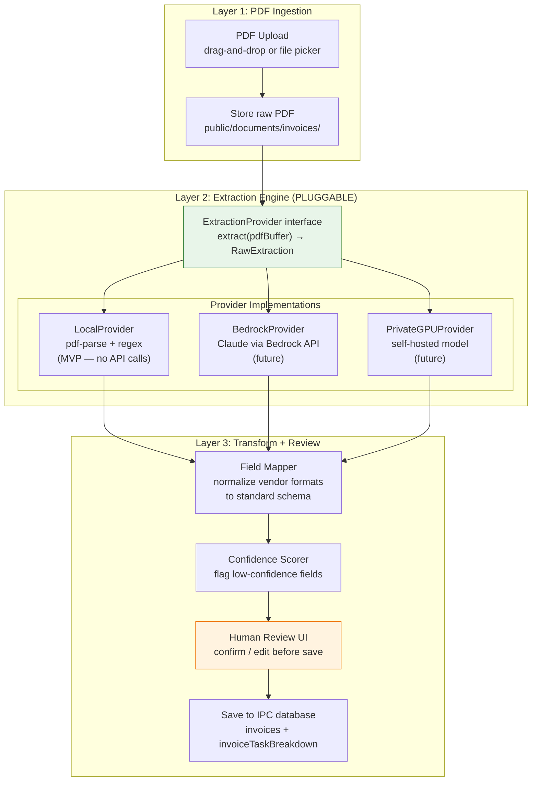
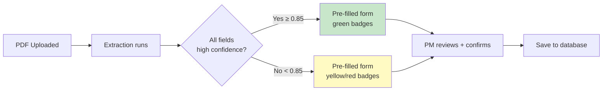
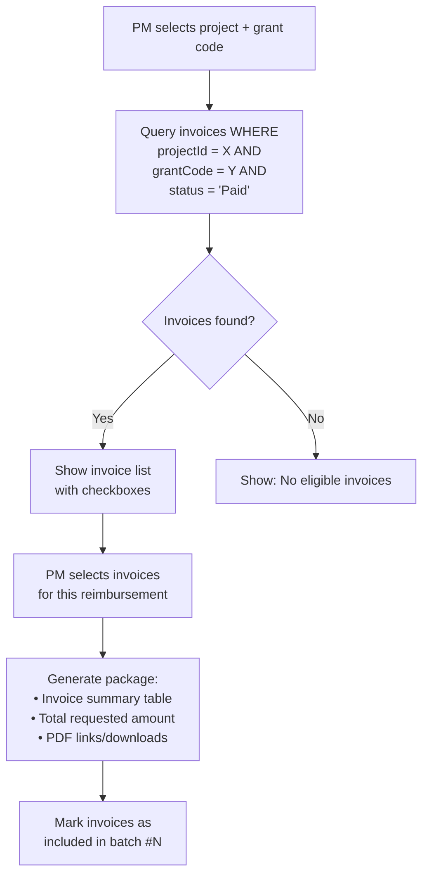

# PDF Invoice Parsing Engine + Grant Package — PRD

> [!NOTE]
> **No coding in this document.** This is the architecture PRD following the pattern-first-dispatch workflow. All changes trace to discovery and the comprehensive PRD.

---

## Problem Statement

Both Shannon and Eric manually transcribe invoice data from PDF into their tracking spreadsheets. With 7–14 active projects each, this is the single highest-volume repetitive task. Both invoices we have are digitally-generated (not scanned), making them excellent candidates for automated extraction.

> **Shannon:** *"You can imagine I have like seven capital projects, Eric has 14. When you're getting a lot of invoices, it just kind of gets bogged down."*

---

## Sample Invoice Analysis

### DEA-599518 (David Evans and Associates)


| Field | Value | Location |
|-------|-------|----------|
| Invoice # | 599518 | Top-right header |
| Vendor | David Evans and Associates Inc. | Center header/logo |
| Date | September 12, 2025 | Top-right |
| Total | $12,553.11 | Bottom row "Subtotal" |
| Project | Catherine Creek Bridge Replacement | "Project LAST0000-2083" |
| Pages | 9 (2 summary + 7 backup) | — |
| Task breakdown | Yes — codes 001-014, SUB01-SUB05 | Tabular, per-task |
| Columns | Contract Amount, Previously Billed, Total To-Date, Percent Complete, Due This Invoice | — |
| Approval stamps | APPROVED, BUDGET: SWCCC, SIGNATURE overlays | — |

### SW-161983 (Shannon & Wilson)


| Field | Value | Location |
|-------|-------|----------|
| Invoice # | 161983 | Top-right |
| Vendor | Shannon & Wilson | Header/logo |
| Date | 12/23/2025 | Top-right |
| Total | ~$15,286.00 | Bottom "Amount Due" |
| Project | Lower Stevens Creek Restoration (115773) | Top-right |
| Pages | 13 (summary + labor/expense detail) | — |
| Task breakdown | Yes — codes 100-700+ | Tabular, per-task |
| Columns | Fee, Available, To Date, Previous, Current | — |
| Approval stamps | APPROVED, Reviewed by Jess R, SIGNATURE overlays | — |

### Key Observations for Parser Design

1. **Both are digitally-generated** — selectable text, no OCR needed for primary extraction
2. **Different layouts** — DEA uses task codes (001, 003, etc.), SW uses hundreds-based codes (100, 200, etc.)
3. **Different column headers** — but semantically equivalent (Contract Amount ≈ Fee, Due This Invoice ≈ Current)
4. **Approval stamps overlay the data** — need to handle extraction even with stamps
5. **Multi-page** — summary on page 1, detailed backups follow
6. **Both have project references** — project names and numbers in headers

---

## Architecture: Provider-Agnostic Extraction Engine

> [!IMPORTANT]
> The extraction engine MUST be designed as a pluggable provider pattern. Local for now (pdf-parse), but swappable to private GPU models or AWS Bedrock without changing the application layer.

### 3-Layer Architecture



### Provider Interface

```typescript
// Shared infrastructure — server/lib/extraction/types.ts
interface ExtractionProvider {
  name: string;
  
  /** Extract raw data from a PDF buffer */
  extract(pdfBuffer: Buffer, options?: ExtractionOptions): Promise<RawExtraction>;
  
  /** Health check — can this provider run? */
  isAvailable(): Promise<boolean>;
}

interface ExtractionOptions {
  /** Only extract from specific page range */
  pageRange?: { start: number; end: number };
  /** Hint: known vendor template for optimized extraction */
  vendorHint?: string;
}

interface RawExtraction {
  /** Provider that produced this extraction */
  providerName: string;
  
  /** Extracted fields with per-field confidence */
  fields: {
    invoiceNumber:   ExtractedField<string>;
    vendor:          ExtractedField<string>;
    date:            ExtractedField<string>;  // raw date string
    totalAmount:     ExtractedField<number>;
    projectName:     ExtractedField<string>;
    projectNumber:   ExtractedField<string>;
  };
  
  /** Task breakdown rows */
  lineItems: ExtractedLineItem[];
  
  /** Full extracted text (for debugging) */
  rawText: string;
}

interface ExtractedField<T> {
  value: T;
  confidence: number;  // 0.0 - 1.0
  source: string;      // e.g. "regex:invoice_number_pattern" or "llm:field_extraction"
}

interface ExtractedLineItem {
  taskCode:       ExtractedField<string>;
  taskName:       ExtractedField<string>;
  contractAmount: ExtractedField<number>;
  previousBilled: ExtractedField<number>;
  currentDue:     ExtractedField<number>;
  confidence:     number;  // overall line confidence
}
```

### Provider 1: LocalProvider (MVP — No API costs)

Uses `pdf-parse` for text extraction + regex patterns for field mapping.

**Strategy:**
1. Extract all text from PDF using `pdf-parse`
2. Apply regex patterns for known field locations:
   - Invoice #: `/Invoice\s*(?:Number|#|No\.?)?\s*:?\s*(\S+)/i`
   - Date: `/Invoice\s*Date\s*:?\s*([\d/\-]+|[A-Z][a-z]+\s+\d+,\s*\d{4})/i`
   - Total: `/(?:Total|Subtotal|Amount Due|Due This Invoice)\s*\$?([\d,]+\.\d{2})/i`
   - Vendor: Extracted from first few lines or matched against known vendor list
3. For task breakdowns: identify tabular data patterns with numeric columns
4. Confidence: high (0.9+) for regex matches, lower (0.6) for inferred fields

**Dependencies:** `pdf-parse` (npm, zero external APIs, MIT license)

### Provider 2: BedrockProvider (Future)

Uses AWS Bedrock with Claude or Titan for structured extraction.

**Strategy:**
1. Extract text with `pdf-parse` as input
2. Send to Bedrock with a structured prompt:
   ```
   Extract the following fields from this invoice text:
   - invoice_number, vendor, date, total_amount, project_name
   - For each line item: task_code, task_name, contract_amount, previous, current_due
   Return as JSON.
   ```
3. Confidence: based on model's own confidence + validation against regex patterns

**Dependencies:** `@aws-sdk/client-bedrock-runtime`, IAM credentials

### Provider 3: PrivateGPUProvider (Future)

Uses a self-hosted model (e.g., Llama, Mistral) on a private GPU.

**Strategy:** Same as Bedrock but hits a local API endpoint instead of AWS.

**Dependencies:** HTTP endpoint to a model server (OpenAI-compatible API format)

### Provider Selection

```typescript
// server/lib/extraction/providerRegistry.ts
const providers: ExtractionProvider[] = [
  new LocalProvider(),     // always available
  new BedrockProvider(),   // available if AWS credentials configured
  new PrivateGPUProvider() // available if GPU endpoint configured
];

async function getProvider(): Promise<ExtractionProvider> {
  // Prefer: PrivateGPU > Bedrock > Local
  for (const p of providers.reverse()) {
    if (await p.isAvailable()) return p;
  }
  return providers[0]; // fallback to Local
}
```

---

## Human Review Flow

> [!WARNING]
> **Never auto-save extracted data without human confirmation.** Municipal invoice processing has financial controls — wrong numbers have real consequences.



### Review UI Spec

- Show the extracted PDF on the left, pre-filled form on the right
- Each field shows a confidence badge: 🟢 High (≥ 0.85) / 🟡 Medium (0.5–0.85) / 🔴 Low (< 0.5)
- PM can edit any field before saving
- "Match to Project" dropdown auto-suggests based on extracted project name
- Task breakdown rows are editable — PM can add/remove/modify before save
- "Save & Create Invoice" button commits to database

---

## Field Mapping: Vendor Format → Standard Schema

| Standard Field | DEA Format | SW Format | IPC Column |
|---------------|-----------|----------|------------|
| Invoice # | "Invoice Number: 599518" | "Invoice: 161983" | `invoices.invoiceNumber` |
| Vendor | "DAVID EVANS AND ASSOCIATES INC." | "SHANNON & WILSON" | `invoices.vendor` |
| Date | "September 12, 2025" | "12/23/2025" | `invoices.dateReceived` |
| Total | Subtotal row, last column | "Amount Due This Bill" | `invoices.totalAmount` |
| Project | "Project LAST0000-2083: Catherine Creek..." | "Project Name: Lower Stevens..." | Matched to `projects.name` |
| Task Code | "001", "003", "SUB01" | "100", "200", "700" | `invoiceTaskBreakdown.taskCode` |
| Task Name | "Project Management", "Surveying" | "Project Management and Coordination" | `invoiceTaskBreakdown.taskDescription` |
| Current Due | "Due This Invoice" column | "Current" column | `invoiceTaskBreakdown.amount` |

---

## Grant Reimbursement Package Wiring

### Current State
The Grant Reimbursement page exists with UI (project selector + grant code input + Build Package button) but the button doesn't do anything.

### What "Build Package" Should Do



### Data Changes
- Add `reimbursementBatchId` nullable field to `invoices` table — tracks which batch included this invoice
- Add `grantReimbursements` table: `id, projectId, grantCode, batchNumber, dateSubmitted, amountRequested, amountReceived, status, invoiceIds (JSON)`

---

## Proposed File Structure

```
server/lib/extraction/
├── types.ts              # ExtractionProvider interface, RawExtraction types
├── providerRegistry.ts   # Provider selection logic
├── providers/
│   ├── localProvider.ts  # pdf-parse + regex (MVP)
│   ├── bedrockProvider.ts    # AWS Bedrock (future stub)
│   └── privateGPUProvider.ts # Self-hosted model (future stub)
├── fieldMapper.ts        # Vendor-specific → standard schema mapping
├── confidenceScorer.ts   # Per-field confidence calculation
└── vendorTemplates/
    ├── david-evans.ts    # DEA-specific regex patterns
    └── shannon-wilson.ts # SW-specific regex patterns
```

---

## Verification Plan

### Automated
- Parse DEA-599518.pdf → verify invoice # = "599518", total = $12,553.11, 12 task rows
- Parse SW-161983.pdf → verify invoice # = "161983", task rows with codes 100-700+
- `npx tsc --noEmit` — clean TypeScript compilation
- Provider registry returns LocalProvider when no credentials configured

### Browser QA
- Upload DEA PDF → review form shows pre-filled fields with green confidence badges
- Edit a field → save → verify invoice record created correctly
- Grant "Build Package" returns matching invoices for FHWA-2025

---

## Key Design Decisions

| Decision | Rationale |
|----------|-----------|
| **Provider interface, not hardcoded parser** | User explicitly said "private GPU or Bedrock" is future. Interface makes swap trivial. |
| **Local-first (pdf-parse + regex)** | No API costs, no credentials, works offline. Good enough for digitally-generated PDFs. |
| **Vendor-specific templates** | DEA and SW have different layouts. Templates are pattern matches, not hardcoded data. |
| **Never auto-save** | Municipal finance controls require human confirmation. |
| **Confidence scoring** | Transparency — PM sees exactly what the system is sure about and what it's guessing. |
| **Reusable for any org** | Provider interface + vendor templates = any municipality can add their own vendors' formats. |
