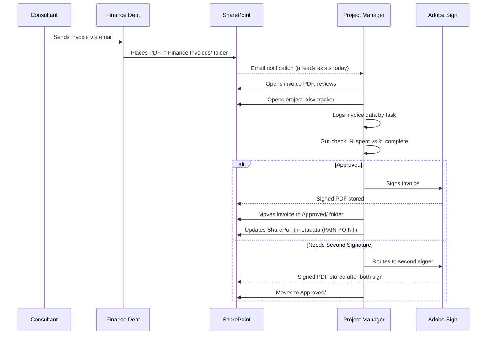
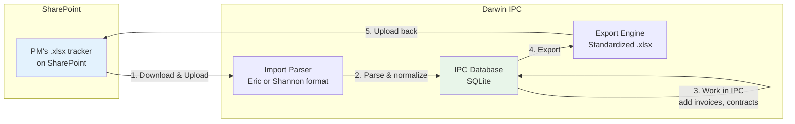
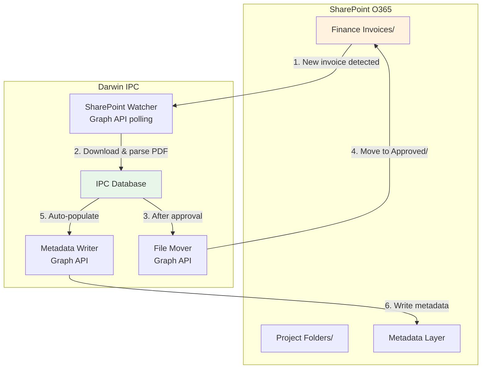

# SharePoint Data Flow & Bidirectional Sync Strategy

> [!NOTE]
> This document maps the current SharePoint-based workflow, the bidirectional .xlsx sync bridge we've built, and the target-state SharePoint API integration. **No code changes — planning and PRD only.**

---

## 1. Current-State SharePoint Folder Hierarchy

Based on the discovery session, the City of Lake Stevens stores capital project data in this SharePoint (O365) structure:

```
SharePoint (O365)
├── Finance Invoices/
│   ├── [Consultant Name]/
│   │   ├── 📄 INV-2025-001.pdf      ← "Shannon needs to find it"
│   │   ├── 📄 INV-2025-002.pdf
│   │   └── ...
│   └── Approved/
│       └── 📄 INV-2025-001_signed.pdf   ← moved after Adobe Sign
│
├── Capital Projects/
│   ├── Main Street Improvements (18013)/
│   │   ├── 📊 18013_Budget.xlsx         ← Eric's tracker
│   │   ├── 📄 Design_PSA_signed.pdf     ← hyperlinked from .xlsx
│   │   ├── 📄 Supplement_1_signed.pdf
│   │   ├── 📄 Supplement_2_signed.pdf
│   │   └── ...
│   ├── 36th St Bridge (19045)/
│   │   ├── 📊 BTR_Expense_Tracking.xlsx ← Shannon's tracker
│   │   └── ...
│   └── [Other Projects]/
│
├── Contracts/
│   └── [General contract folder — sometimes duplicates project folder]
│
└── Finance Team/
    ├── 📊 2026_Capital_Project_Tracker.xlsx  ← Finance's Springbrook view
    └── Budget Reference (Springbrook account numbers)
```

> **Eric:** "The links lead to the contract... that's the actual signed contract. Link directly to the signed. Which lives in SharePoint."
>
> **Eric:** "Sometimes contracts are in the project folder. Sometimes contracts are in our general contract folder. Usually it's more like a duplicate."

---

## 2. Invoice Lifecycle Through SharePoint



> **Eric's #1 pain point:** "The biggest pain point now with SharePoint is that we have to manually put all the metadata in."

---

## 3. Bidirectional .xlsx Sync — What Exists Today

The MVP already supports a **round-trip sync loop** with SharePoint via .xlsx files:



### Current Sync Behaviors

| Step | What Happens | Discovery Trace |
|------|-------------|-----------------|
| **Import (Eric)** | Parse 18013_Budget.xlsx: Overview, Design, ROW, CM, Construction tabs → projects, contracts, invoices, funding sources, ROW parcels | [dev-plan L182-183] |
| **Import (Shannon)** | Parse BTR Expense Tracking: Budget Worksheet, DEa tab, Breakdown by task → same data model, handles 32-col and simple variants | [dev-plan L182-185] |
| **Re-import** | Shannon's parser merges by `invoiceNumber` — updates existing records, no duplicates. Eric's parser currently does NOT deduplicate. | [PRD limitations] |
| **Export** | Standardized .xlsx with 4 tabs: Budget Worksheet, Contract Summary, Invoice Log, Overview. Includes formulas for standalone use. | [dev-plan L188-196] |

> **Daniel (dev plan):** "Spreadsheet export to SharePoint is an output format for interoperability, especially during initial rollout. It must work both ways — import and export — but the app is the source of truth going forward."

### Known Gaps in Current Bidirectional Sync

| Gap | Impact | Mitigation |
|-----|--------|------------|
| Eric re-import does not deduplicate | Could create duplicate invoices on re-import | Add invoice # merge key to Eric parser |
| No automatic SharePoint upload | PM must manually download/upload .xlsx | Future: SharePoint Graph API |
| Export doesn't preserve original format | Shannon gets standardized format, not her BTR layout | Acceptable — standard IS the goal |
| No conflict resolution mechanism | If PM edits both IPC and .xlsx simultaneously, last-write-wins | Document convention: IPC is source of truth |
| No change tracking / diff | PM can't see what changed between import rounds | Future: changelog view |

---

## 4. Target-State: SharePoint API Integration (Future Phase)

> [!IMPORTANT]
> This requires coordination with the IT Director. Eric explicitly mentioned this need. Not in current MVP scope.

### Architecture



### Capabilities by Phase

| Phase | Capability | Dependency |
|-------|-----------|------------|
| **Phase 1 (Current)** | Manual .xlsx import/export, PM downloads and uploads | None |
| **Phase 2** | Auto-export .xlsx to SharePoint project folder via Graph API | IT Director meeting, O365 app registration |
| **Phase 3** | Watch Finance Invoices/ folder for new PDFs, auto-ingest | Graph API + PDF parser (OCR or structured) |
| **Phase 4** | Auto-move signed invoices, auto-populate SharePoint metadata | Graph API write access |
| **Phase 5** | Real-time bidirectional sync — changes in IPC auto-update .xlsx on SharePoint | Full Graph API integration |

> **Daniel:** "Part of this could also be automatically building that metadata layer inside of your SharePoint, which makes SharePoint more usable for you guys when you want to search it or anything."
>
> **Eric:** "Definitely."

### Graph API Endpoints Needed

| Action | API | Permission Scope |
|--------|-----|-----------------|
| List files in folder | `GET /drives/{id}/items/{folder}/children` | `Files.Read` |
| Download file | `GET /drives/{id}/items/{id}/content` | `Files.Read` |
| Upload file | `PUT /drives/{id}/items/{folder}:/{name}:/content` | `Files.ReadWrite` |
| Move file | `PATCH /drives/{id}/items/{id}` (update `parentReference`) | `Files.ReadWrite` |
| Update metadata | `PATCH /drives/{id}/items/{id}/listItem/fields` | `Sites.ReadWrite.All` |
| Watch for changes | `POST /subscriptions` (webhook on drive changes) | `Files.Read` + webhook endpoint |

---

## 5. Revert Point

If needed, all current code changes can be reverted with:
```bash
git checkout . 
# Returns to commit f34eb00 (pre-MVP toggle changes)
```
