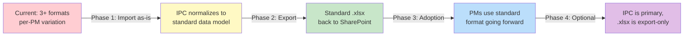

# Standardized Capital Project .xlsx Template — PRD

> [!NOTE]
> This defines the **single standardized spreadsheet format** that replaces Eric's 18013_Budget style and Shannon's BTR Expense Tracking style. Both PMs agreed to standardize during discovery.

---

## Problem Statement

The team currently uses at least **3 different spreadsheet formats** across a handful of project managers:
- **Eric's format:** Multi-tab (Overview, Design, ROW, CM Services, Construction) with hyperlinks to signed contracts, Springbrook budget codes, and milestone dates
- **Shannon's simple format:** Budget Worksheet + DEa tab, high-level task tracking
- **Shannon's detailed format:** Same structure but with 32-column task breakdown

> **Eric:** "Our biggest need right now is just the organization and creating standards."
> **Shannon:** "I think we could easily standardize whatever we need to. Just our challenge is having the time."
> **Eric:** "Even if we have three different standards, at least then it's only three."

**Goal:** One standard template that captures the best of all formats — Eric's comprehensiveness and Shannon's clarity — while remaining functional as a standalone spreadsheet.

---

## Template Specification

### Tab 1: Overview

The project-level summary. Replaces Eric's Overview sheet.

| Row/Section | Field | Source | Notes |
|------------|-------|--------|-------|
| **Header** | Project Name | Manual/IPC | e.g., "Main Street Improvements" |
| | CFP # | City budget | Capital Facilities Plan number (standardized across depts) |
| | Project # | City assigned | e.g., RD-101 |
| | Project Type | Manual | ST / PA / FA / SW |
| | Project Manager | Manual | Name |
| | Council Auth Date | Manual | Date council authorized project |
| **Budget Sources** | Source Name | Manual/finance | e.g., "FHWA Grant", "TIZ 1" |
| | Springbrook Code | Finance/ERP | Display-only, e.g., 301-000-333-20-20-50 |
| | Allocated Amount | Finance/budget | Per-source allocation |
| | Year Breakdown | Finance/budget | 2025, 2026, 2027 columns |
| **Budget Summary** | Category | Auto-generated | Design, ROW, CM_Services, Construction, Inspector_Material, Permitting, Misc |
| | Projected Cost | Manual/contract | From contract amounts |
| | Paid to Date | =SUM from invoice tabs | **Computed, never manually entered** |
| | Balance Remaining | =Projected - Paid | Formula |
| | % Spent | =Paid / Projected | Formula |
| | % Scope Complete | Manual or TaskLine | PM estimate |
| | Health | =IF(% Spent > % Scope + 15%, "🔴", ...) | Gut-check formula |

### Tab 2: Design

Tracks the Design contract, supplements, and invoice log.

| Column | Description | Type |
|--------|------------|------|
| A | Contract: Vendor | Text |
| B | Contract: Original Amount | Currency |
| C | Contract: Supplement 1 (amount, date, link) | Currency + hyperlink |
| D | Contract: Supplement 2 | Currency + hyperlink |
| E | Contract: Cumulative Total | =B+C+D formula |
| F | Signed Contract Link | Hyperlink to SharePoint |
| — | — | — |
| G | Invoice # | Text (e.g., INV-2025-001) |
| H | Date Received | Date |
| I | Total Amount | Currency |
| J-P | Task Breakdown (PM, Surveying, Environmental, etc.) | Currency per task |
| Q | Running Total | =SUM formula |
| R | Contract Remaining | =E-Q formula |
| S | Grant Code | Text (if grant-eligible) |
| T | Reimbursement Batch | Text (which reimbursement submission) |
| U | Status | Received / Logged / Reviewed / Signed / Paid |
| V | Notes | Text |

### Tab 3: ROW Parcels

Right-of-way tracking. Structurally different from invoices — tracked by parcel, not invoice.

| Column | Description |
|--------|------------|
| A | Parcel Number |
| B | Property Owner |
| C | Expenditure Type (acquisition, appraisal, legal, etc.) |
| D | Amount |
| E | Status |
| F | Notes |

### Tab 4: CM Services

Same structure as Tab 2 (Design), but for Construction Management Services contract.

### Tab 5: Construction

Same structure as Tab 2 (Design), but for Construction contract.

### Tab 6: Funding & Grants

Consolidates funding sources and grant reimbursement tracking.

| Column | Description |
|--------|------------|
| A | Source Name |
| B | Grant/Loan/Local |
| C | Springbrook Budget Code |
| D-F | Year Allocations (2025, 2026, 2027) |
| G | Total Allocated |
| H | Amount Drawn |
| I | Amount Remaining |
| — | — |
| J | Reimbursement # |
| K | Date Submitted |
| L | Invoice Numbers Included |
| M | Amount Requested |
| N | Amount Received |
| O | Status |

---

## Key Design Decisions

### 1. Invoice Task Breakdown Is the Source of Truth

> [!IMPORTANT]
> `Paid to Date` on the Overview tab is **always a formula** referencing invoice tabs. Never manually entered. This is how Shannon's gut-check works — the math has to match.

### 2. Hyperlinks to SharePoint Documents

Each contract and supplement has a hyperlink column pointing to the signed PDF on SharePoint. This preserves Eric's workflow of linking directly to signed documents.

### 3. Springbrook Codes Are Display-Only

Budget codes from Springbrook appear in the Overview and Funding tabs for reference. The spreadsheet **never writes to Springbrook** — those codes are read-only metadata.

### 4. Per-Tab Contract Isolation

Each contract type (Design, CM, Construction) gets its own tab. This matches Eric's existing structure and avoids the confusion of mixing contract types in a single invoice log.

### 5. Grant Tracking in Funding Tab (Not Scattered)

Shannon currently tracks grant eligibility per-invoice inline. The standardized format consolidates reimbursement tracking into the Funding & Grants tab, with invoice references — making package assembly faster.

---

## Backward-Compatible Import Rules

The import parsers must handle old formats AND the new standard:

| Format Detected | Detection Rule | Parser |
|----------------|---------------|--------|
| Eric's 18013_Budget | Has "Overview" tab + "Design" tab with contract hyperlinks | xlsx-eric-parser |
| Shannon BTR Simple | Has "Budget Worksheet" tab + < 10 task columns in DEa | xlsx-shannon-parser (simple) |
| Shannon BTR Detailed | Has "Budget Worksheet" tab + 32 task columns in DEa | xlsx-shannon-parser (detailed) |
| **New Standard** | Has "Overview" tab + "Funding & Grants" tab + Health column | xlsx-standard-parser (NEW) |

> The new standard parser should be the **simplest** since the format exactly matches the IPC data model.

---

## Migration Strategy

**Phase 1 (now):** Import existing spreadsheets as-is using format-specific parsers
**Phase 2 (now):** Export always produces the standard format
**Phase 3 (rollout):** PMs start using the standard format for new projects
**Phase 4 (maturity):** IPC is the source of truth; .xlsx is a read-only export for SharePoint interop

> **Daniel (dev plan):** "Import is the migration strategy... PMs don't have to re-enter anything. Export is the safety net... Over time, they stop exporting because the app is better."
